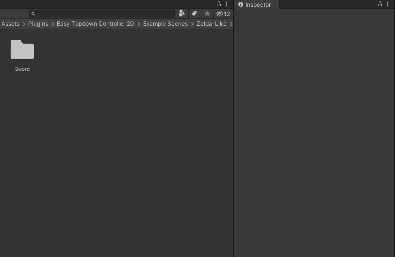

# Animation
Animations are first class citizens for Easy Top-down Controller 2D, so they are tightly integrated with the rest of the system.  
Also, animations are designed to be as simple and portable as possible, so any animation can be easily replaced by another.

To create a new one, go to the Project view, right click and choose `Create > Easy TopDown Controller 2D > Animation`. 

Selecting it will display all the parameters in the inspector.

## How to assign sprites to each direction

## Time
Time it takes for the animation to play, in seconds.  
Default value: `1`

## Right
The animation that will be played when the player is facing right.
To assign new sprites to the animation, go to the Project view and drag and drop the corresponding sprites (click the lock icon on the inspector to be able to select the sprites correctly).
**IMPORTANT: If no sprites are present, the animation will not be used, and instead will show a white square**.

## Left
The animation that will be played when the player is facing left.
To assign new sprites to the animation, go to the Project view and drag and drop the corresponding sprites (click the lock icon on the inspector to be able to select the sprites correctly).
**IMPORTANT: If no sprites are present, the animation will not be used, and instead will show a white square**.

## Up
The animation that will be played when the player is facing up.
To assign new sprites to the animation, go to the Project view and drag and drop the corresponding sprites (click the lock icon on the inspector to be able to select the sprites correctly).
**IMPORTANT: If no sprites are present, the animation will not be used, and instead will show a white square**.

## Down
The animation that will be played when the player is facing down.
To assign new sprites to the animation, go to the Project view and drag and drop the corresponding sprites (click the lock icon on the inspector to be able to select the sprites correctly).
**IMPORTANT: If no sprites are present, the animation will not be used, and instead will show a white square**.