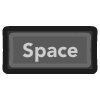

--- 
layout: default
title: Top-down Shooter
parent: Examples
permalink: examples/shooter
nav_order: 4
---

<iframe id="" src="Shooter-Build" name="" width="960" height="540" frameborder="0" marginheight="0" scrolling="no"></iframe>

Top-down shooter example, dodge the enemy bullets while shooting at them.

### Controls

|         | Mouse/Keyboard | Controller |
| ------: | :-------------:  | :----------: |
|  Move   |          |  |
| Shoot |  |  |
| Aim | Mouse cursor |  |
| Dodge |   |   |

### Mechanics used
- `Shoot` and `Dodge`
  - Built-in actions.
- `Shoot While Button Pressed`
  - Keep shooting if the shoot button is held down, but only if a certain amount of time has passed.
- `Shoot Direction: Mouse/Joystick`
  - Specify the direction the player shoots in. 
    In this case, the direction is set to `Mouse/Joystick`, so the player can aim their gun with the mouse/joystick. 
    The possible options are:
    - `Mouse/Joystick`
    - `Player Facing`
    - `Fixed`
- `Shooter Rotation`
  - Makes the player face the mouse cursor (or the right stick on a controller). 
    Instead of rotating the player transform, it changes to the sprite corresponding on the direction the player is facing.
- `Roll Interrupts Attack`
  - If enabled, the player will be able to roll while attacking. 
    This will interrupt the attack animation and make the shooting smoother.
- `Roll Follows Movement Direction`
  - If enabled, instead of dodging towards the direction the player is facing, the player will roll towards the direction they are moving.