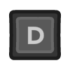

--- 
layout: default
title: Shoot'em up
parent: Examples
permalink: examples/space
nav_order: 3
---

<iframe id="" src="Space-Build" name="" width="960" height="540" frameborder="0" marginheight="0" scrolling="no"></iframe>

Shoot'em up example, avoid the asteroids and shoot to push them away.

### Controls

|         | Mouse/Keyboard | Controller |
| ------: | :-------------:  | :----------: |
|  Move   |          |  |
| Shoot |    |  |

### Mechanics used
- `Shoot`
  - One of the built-in actions.
- `Shoot While Button Pressed:`
  - Keep shooting if the shoot button is held down, but only if a certain amount of time has passed.
- `Disable Animation`
  - This example disables the Shoot animation as it's not needed. 
    Instead, the Walk and Idle animations continue playing. 
- `Shoot Direction`
  - Specify the direction the player shoots in. 
    In this case, the direction is set to be fixed, and upright. 
    The possible options are:
    - `Mouse/Joystick`
    - `Player Facing`
    - `Fixed`