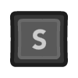

--- 
layout: default
title: Zelda-like
parent: Examples
permalink: examples/zelda
nav_order: 2
---

<iframe id="" src="Zelda-Build" name="" width="960" height="540" frameborder="0" marginheight="0" scrolling="no"></iframe>

Zelda-like example, non-restricted movement with the ability to attack and destroy objects.

### Controls

|         | Mouse/Keyboard | Controller |
| ------: | :-------------:  | :----------: |
|  Move   |          |  |
| Attack |    |  |

### Mechanics used
- `Attack`
  - One of the built-in actions.
- `Attack Direction: Facing`
  - Specify the direction the player attacks to. 
    In this case, the player attacks towards the direction in which they are facing. 
    The possible options are:
    - `Mouse/Joystick`
    - `Player Facing`
    - `Fixed`
- `Stop When Attack`
  - Specify if the player should stop moving when attacking. 
    It can give a retro feel to the game.